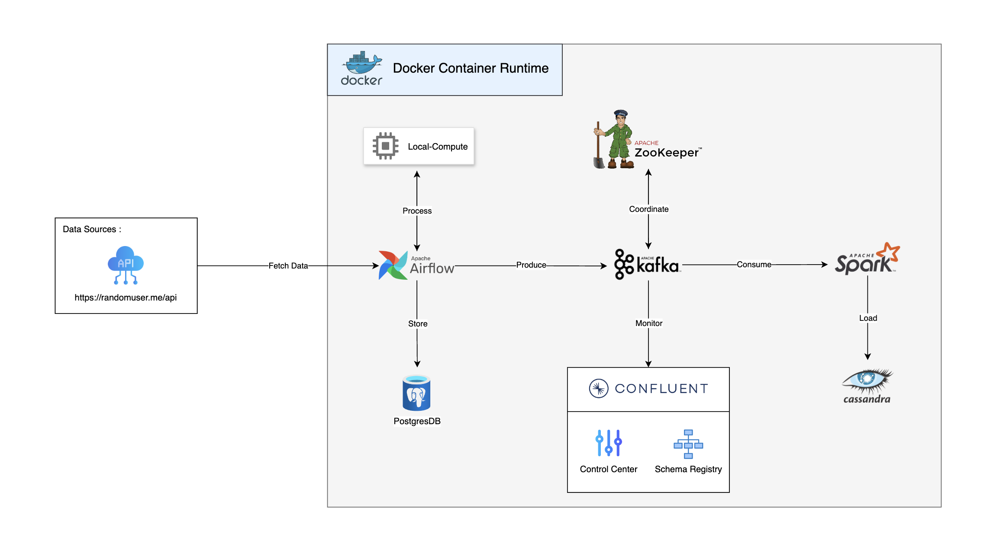

# Realtime Data Streaming Project

This project demonstrates a full end-to-end real-time data streaming pipeline using modern technologies like Apache Kafka, Apache Spark, and Cassandra, all within Docker containers. Data is fetched from the **randomuser API** and streamed into Kafka via an Apache Airflow DAG running for 1 minute.

Kafka streams are processed in real-time by **Apache Spark** and the reformatted data is stored in **Cassandra**. The Kafka infrastructure, including **Confluent Control Center** and **Schema Registry**, is used for monitoring and maintaining data integrity throughout the pipeline.


## Project architecture


## Table of Contents

1. [Project Overview](#project-overview)
2. [Technology Used](#technology-used)
3. [Setup and Installation](#setup-and-installation)
4. [Steps](#steps)
5. [Usage](#usage)
6. [Project Structure](#project-structure)
7. [Features](#features)

## Project Overview

The project fetches data from an external API and processes it using Apache Airflow, then streams the data through Apache Kafka for real-time processing in Apache Spark. The processed data is stored in a Cassandra database. The infrastructure is containerized using Docker and monitored with Confluent.

## Technology Used

- **Docker**: Containerization of all services.
- **Apache Airflow**: For orchestrating data fetch and process pipelines.
- **Apache Kafka**: For real-time data streaming.
- **Apache Spark**: For real-time data processing.
- **Cassandra**: NoSQL database for storing processed data.
- **ZooKeeper**: For Kafka coordination.
- **Confluent**: For Kafka monitoring and schema registry.
- **PostgreSQL**: For intermediate data storage.

## Setup and Installation

1. **Clone the Repository**: Clone this repository to your local machine.

    ```bash
    git clone https://github.com/charucjoshi/RDStream.git
    ```

2. **Install Docker and Docker Compose**: Ensure you have Docker installed on your system.

    - [Install Docker](https://docs.docker.com/get-docker/)
    - [Install Docker Compose](https://docs.docker.com/compose/install/)

3. **Configure `config.yaml`**: Update `config.yaml` to include your specific configurations such as API endpoints, Kafka topics, etc.

4. **Start the Docker Containers**: Use `docker-compose` to build and start the containers.

    ```bash
    docker-compose up --build
    ```

5. **Install Python Dependencies**: Install the required Python packages.

    ```bash
    pip install -r requirements.txt
    ```

## Steps

1. **Fetch Data**: Apache Airflow fetches data from the external API `https://randomuser.me/api` and stores it in PostgreSQL.
2. **Stream to Kafka**: The data is streamed from Airflow into Kafka using a custom Kafka producer.
3. **Process with Spark**: Spark consumes the Kafka stream, processes the data, and prepares it for storage.
4. **Store in Cassandra**: The processed data is stored in Cassandra for further analysis or querying.
5. **Monitor with Confluent**: Kafka is monitored via Confluent for ensuring stream health and data integrity.

## Usage

1. **Clone the Repository**: 
   Clone this repository to your local machine.

   ```bash
   git clone https://github.com/charucjoshi/RDStream.git
   cd RDStream 
   ```
2. **Prepare Your Configuration**: Ensure all configuration files, including `config.yaml`, are correctly set before starting the services.

3. **Set PYTHONPATH**: Export the `PYTHONPATH` to include the project directory (either on your local machine or within Docker).
    ```bash
   export PYTHONPATH=path/to/RDStream
   ```
4. **Launch Docker Composer**: Start the services by running the following command:
    ```bash
    docker compose up -d
    ```
5. **Trigger the Airflow DAG**: Initiate the Airflow DAG that fetches data from the API and streams it to Kafka.
    ```bash
    airflow dags trigger stream_to_kafka
    ```
    - Or monitor the Airflow DAG at `http://localhost:8080`
6. **Monitor Kafka**: Use Confluent's Control Center to monitor Kafka topics and the streaming status.
    - Access the Control Center at: `http://localhost:9021`
7. **Launch Cassandra**: Enter Cassandra's interactive shell to query the database.
    ```bash
    docker exec -it cassandra cqlsh -u cassandra -p cassandra localhost 9042
    ```
8. **Submit Spark Job**: Stream data from Kafka to Cassandra using Spark.
    ```bash
    spark-submit --master spark://localhost:7077 spark_stream.py
    ```
9. **Query Data in Cassandra**: View the streamed data in Cassandra.
    - Describe the data
        ```sql
        DESCRIBE spark_streams.created_users
        ```
    - View the data
        ```sql
        SELECT * from spark_streams.created_users
        ```

## Project Structure

- **`README.md`**: Provides an overview and instructions for the project.
- **`config.yaml`**: Configuration file for variable settings.
- **`dags/`**: Contains Airflow DAGs.
  - **`stream_to_kafka.py`**: Main DAG to handle data fetching and streaming to Kafka.
- **`docker-compose.yml`**: Docker Compose file to set up the environment.
- **`helpers/`**: Contains helper SQL scripts.
  - **`create_table_created_users.sql`**: Script to create necessary tables in PostgreSQL.
- **`jobs/`**: Contains streaming and processing scripts.
  - **`kafka_stream.py`**: Kafka producer logic to stream data.
  - **`spark_stream.py`**: Spark consumer logic to process the Kafka stream.
- **`plugins/`**: Contains custom Airflow classes.
  - **`kafka_streamer.py`**: A class for fetching data from API and managing Kafka streaming.
  - **`spark_streamer.py`**: A class for handling Spark streaming and Cassandra connector.
  - **`utils/`**: Utility modules for configurations and helper functions.
    - **`configparser.py`**: Custom parser for handling YAML configurations.
- **`requirements.txt`**: Lists the Python packages required for the project.
- **`script/entrypoint.sh`**: Shell script to automate Docker container startup.


## Features

- **Real-time Data Streaming**: Handles real-time data ingestion and processing using Kafka and Spark.
- **API Integration**: Fetches data dynamically from an API source.
- **Dockerized Environment**: Complete setup using Docker and Docker Compose for easy deployment.
- **Kafka Monitoring**: Uses Confluent for Kafka topic and schema monitoring.
- **Scalable Architecture**: Easily extendable for additional data sources or processing logic.

